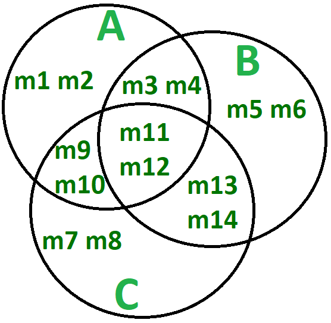
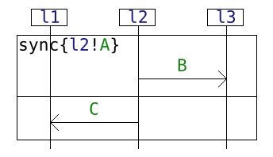
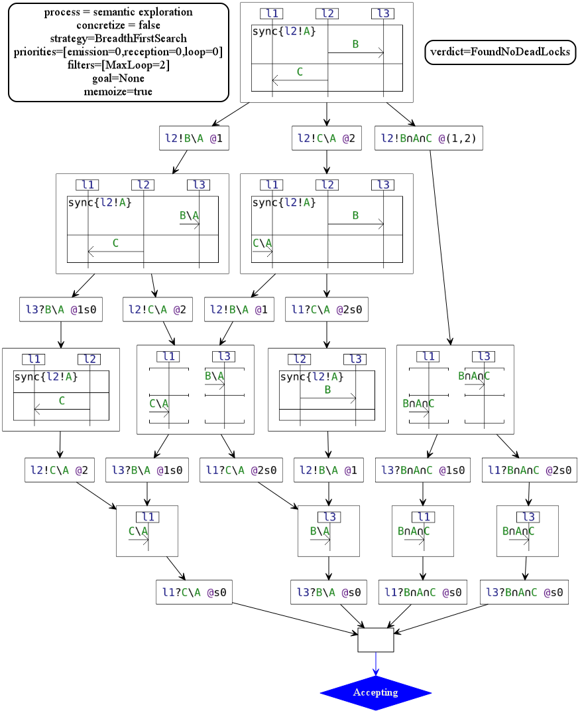
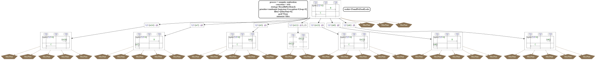
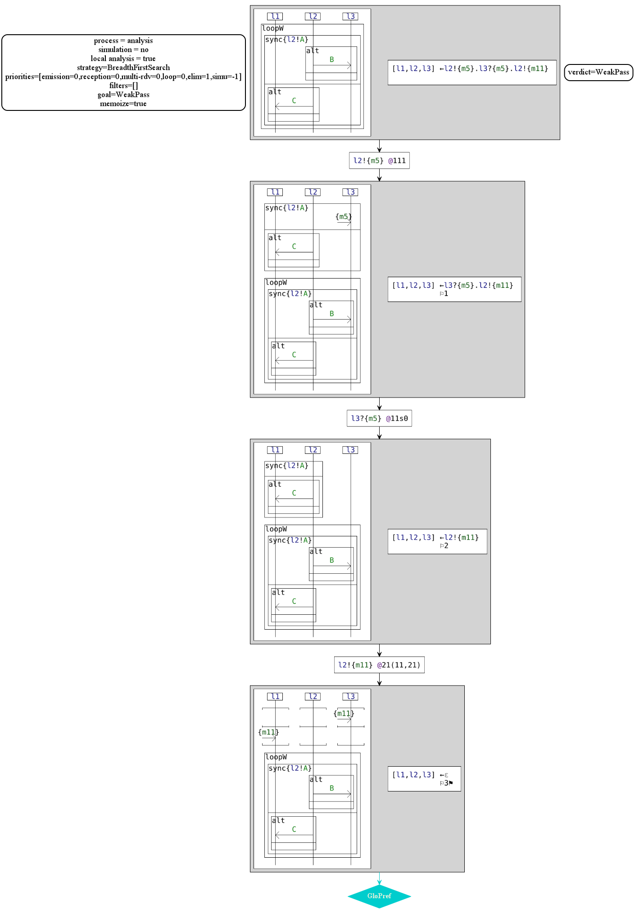

# HIBOU PASSING

HIBOU (for Holistic Interaction Behavioral Oracle Utility) provides utilities for the analysis of traces and
multi-traces collected from the execution of Distributed Systems against interaction models.

This present version "hibou_passing" treats interaction models enriched with typed message passing.

"hibou_passing" is a fork and extension of "[hibou_label](https://github.com/erwanM974/hibou_label)".

## Example

As an illustration let us consider three types of messages "A", "B" and "C".
For the purpose of illustration let us consider these types finite and intersecting as illustrated by the figure below.
Each individual message represented by m1, m2, ..., m4 is of one or several types in "A", "B" and "C".

The interaction model below describes a scheme of communication between three entities "l1", "l2" and "l3".
l2 emits a message of type B to l3 and a message of type C to l1.
However if l2 emits a message which is also of type A, it must synchronize the emission events so that the process equates a broadcast to both "l1" and "l3".
The "sync" opera&tor forces the synchronization of both emission events in case a message of type "A" is concerned.

The figure below describes the semantics of this example interaction by unfolding all the possible paths of execution,
abstracting away individual messages using set-theoretic expressions of types.

If we were to explore the concrete semantics we would rather have the following (shortened) :

The following represents the concrete analysis of a trace against a similar specification :

